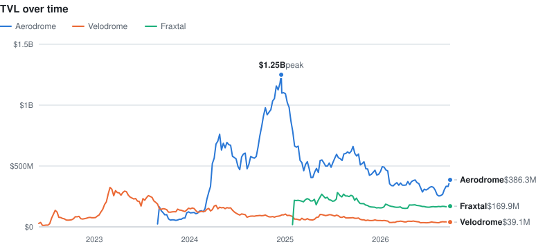

<!-- BADGE:START -->

<!-- BADGE:END -->

## Protocols I engineered

<!-- TVL:START -->
<picture>
  <source media="(prefers-color-scheme: dark)" srcset="assets/tvl-dark.svg">
  
</picture>

| Protocol | TVL now* | Peak TVL* |
|---|---|---|
| [Aerodrome](https://defillama.com/protocol/aerodrome) | $372.0M | $1.25B (Dec 2024) |
| [Velodrome](https://defillama.com/protocol/velodrome) | $37.9M | $324.0M (Mar 2023) |
| [Fraxtal](https://defillama.com/protocol/fraxtal) | $168.9M | $281.2M (Jul 2025) |

*Fetched 2026-09-24 14:30 UTC. See [the update script](scripts/update_tvl.py) for details.
<!-- TVL:END -->

## Tokens I developed

<!-- TOKENS:START -->
**Protocol tokens**

| Token | Chain | Market cap* | Peak market cap* | Contract |
|---|---|---|---|---|
| AERO | Base | $705.8M | $1.50B (Dec 2024) | [`0x9401…8631`](https://basescan.org/address/0x940181a94A35A4569E4529A3CDfB74e38FD98631) |
| VELO | Optimism | $39.6M | $242.0M (Dec 2024) | [`0x9560…88Db`](https://optimistic.etherscan.io/address/0x9560e827aF36c94D2Ac33a39bCE1Fe78631088Db) |

**Frax LayerZero OFTs**

| Token | Market cap* | Peak market cap* |
|---|---|---|
| frxUSD | $104.8M | $140.1M (May 2026) |
| sfrxUSD | $33.1M | $46.1M (Apr 2026) |
| frxETH | $164.0M | $1.20B (Mar 2024) |
| sfrxETH | $116.1M | $856.0M (Mar 2024) |
| FRAX (WFRAX, formerly FXS) | $26.7M | $226.9M (Sep 2025) |

**FXB bonds**

| Bond | Chain | Maturity | Value Issued* | Contract |
|---|---|---|---|---|
| FXB_20240630 | Ethereum | 2024-06-30 | $4.3M | [`0x0dE5…df1e`](https://etherscan.io/address/0x0dE54CFdfeD8005176f8b7A9D5438B45c4F1df1e) |
| FXB_20241231 | Ethereum | 2024-12-31 | $4.7M | [`0xF8FD…6F09`](https://etherscan.io/address/0xF8FDe8A259A3698902C88bdB1E13Ff28Cd7f6F09) |
| FXB20251231 | Fraxtal | 2025-12-31 | $3.6M | [`0xacA9…C6CA`](https://fraxscan.com/address/0xacA9A33698cF96413A40A4eB9E87906ff40fC6CA) |
| FXB_20261231 | Ethereum | 2026-12-31 | $6.0M | [`0x7623…4ff3`](https://etherscan.io/address/0x76237BCfDbe8e06FB774663add96216961df4ff3) |
| FXB20271231 | Fraxtal | 2027-12-31 | $4.3M | [`0x6c9f…A818`](https://fraxscan.com/address/0x6c9f4E6089c8890AfEE2bcBA364C2712f88fA818) |
| FXB20291231 | Fraxtal | 2029-12-31 | $12.7M | [`0xF1e2…2153`](https://fraxscan.com/address/0xF1e2b576aF4C6a7eE966b14C810b772391e92153) |
| FXB20551231 | Fraxtal | 2055-12-31 | $13.6M | [`0xc381…EA83`](https://fraxscan.com/address/0xc38173D34afaEA88Bc482813B3CD267bc8A1EA83) |

*Fetched 2026-09-24 14:30 UTC. See [the update script](scripts/update_tvl.py) for details.
<!-- TOKENS:END -->
